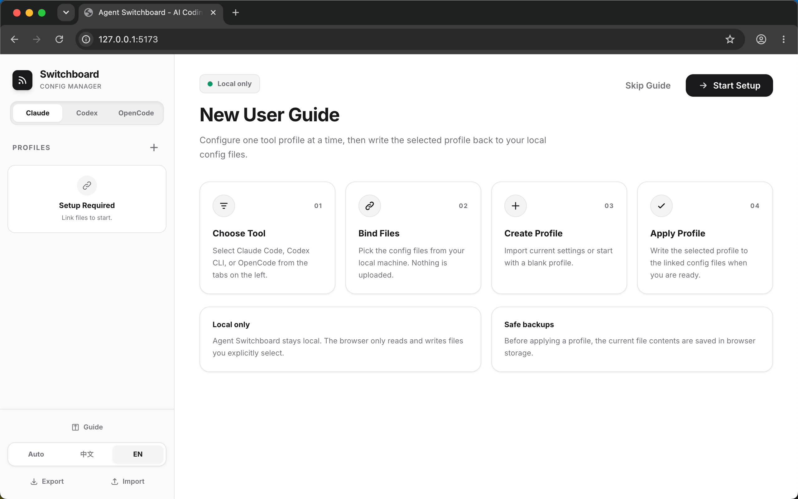
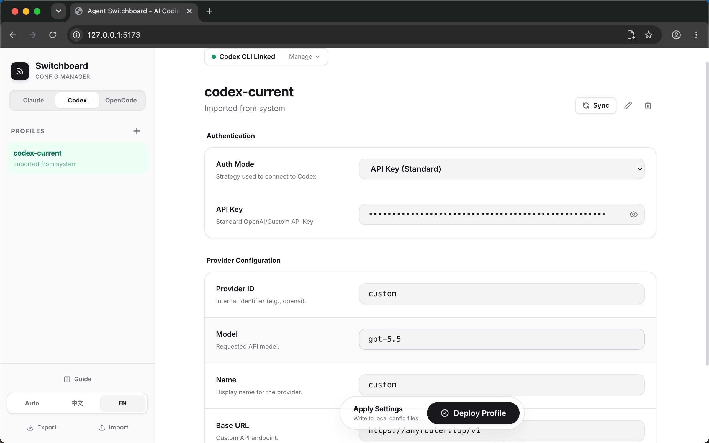
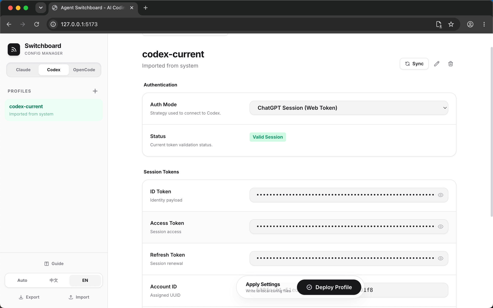

<div align="center">

# Agent Switchboard

**A local-only profile switcher for Claude Code, Codex CLI, and OpenCode.**

[中文](README.zh-CN.md) · [GitHub](https://github.com/xzulab/AgentSwitchboard) · [License](LICENSE)

</div>

```text
Open Source: https://github.com/xzulab/AgentSwitchboard
```

Agent Switchboard helps you manage local AI coding tool configurations as named profiles. Switch between models, API gateways, and authentication modes without manually editing config files.

It runs as a static web page. There is no backend, no database, and no upload step. The browser only reads and writes files that you explicitly select.

## Preview

<p align="center">
  
</p>

## Highlights

- **Local first**: profiles stay in browser storage and authorized local files.
- **Multi-tool**: manage Claude Code, Codex CLI, and OpenCode separately.
- **Safe apply**: writes selected profiles back to disk with a snapshot before changes.
- **Codex ready**: supports `config.toml`, `auth_mode`, `auth.json`, API Key, and ChatGPT Session profiles.
- **Bilingual UI**: auto-detects Chinese or English, with manual switching in the sidebar.
- **Static deploy**: works on `localhost` or any HTTPS static host.

## Friendly Links

- [linux.do](https://linux.do/)

## Screenshots

| Codex API Key | Codex ChatGPT Account |
| --- | --- |
|  |  |

## Supported Files

| Tool | File |
| --- | --- |
| Claude Code | `~/.claude/settings.json` |
| Codex CLI config | `~/.codex/config.toml` |
| Codex CLI auth | `~/.codex/auth.json` |
| OpenCode | `~/.config/opencode/opencode.json` |

## Quick Start

Start a static file server from the repository root:

```bash
python3 -m http.server 5173
```

Open:

```text
http://localhost:5173/
```

On first use, bind the configuration files for the tool you want to manage. On macOS, press `Command + Shift + .` in the file picker to show hidden directories.

## Workflow

1. Choose a tool: Claude Code, Codex CLI, or OpenCode.
2. Bind the local configuration files required by that tool.
3. Import current settings or create a blank profile.
4. Edit model, endpoint, authentication mode, and related settings.
5. Apply the selected profile to write it back to local configuration files.

## Security Boundary

- Agent Switchboard only accesses files you select.
- File handles are stored in browser IndexedDB.
- Profiles are stored in browser localStorage.
- Exported JSON may include API keys or login cache data. Do not commit it to a public repository.
- Static hosting only serves the page. It does not receive or store your local configuration files.

## Deploy

The repository includes `vercel.json`, which rewrites `/` to `index.html`.

```bash
vercel
vercel deploy --prod
```

For Vercel dashboard deployment, import the repository, choose `Other` or `No Framework`, leave the build command empty, and keep the root directory as the output directory.

## Project Structure

```text
.
├── docs/
│   ├── guide_zh.png
│   ├── guide_en.png
│   ├── codex_key_zh.png
│   ├── codex_key_en.png
│   ├── codex_account_zh.png
│   └── codex_account_en.png
├── LICENSE
├── README.md
├── README.zh-CN.md
├── index.html
└── vercel.json
```

## Development Notes

The project is intentionally kept as a single-file implementation for simple hosting and easier review. If a build pipeline is introduced later, make sure File System Access API permissions, permission prompts, and config write-back behavior still work under HTTPS or `localhost`.

## Contributing

Issues and pull requests are welcome. Useful directions include:

- Add adapters for more AI coding tools
- Add configuration diff preview
- Add a backup restore interface
- Improve mobile and narrow-screen layouts

## License

MIT
