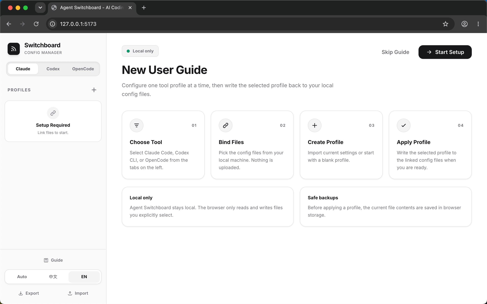
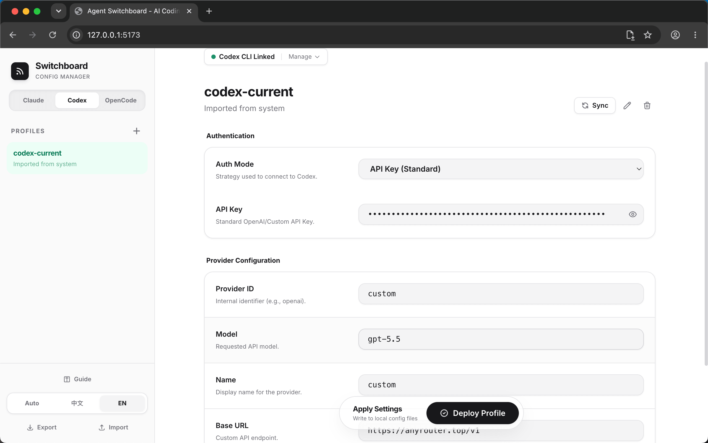
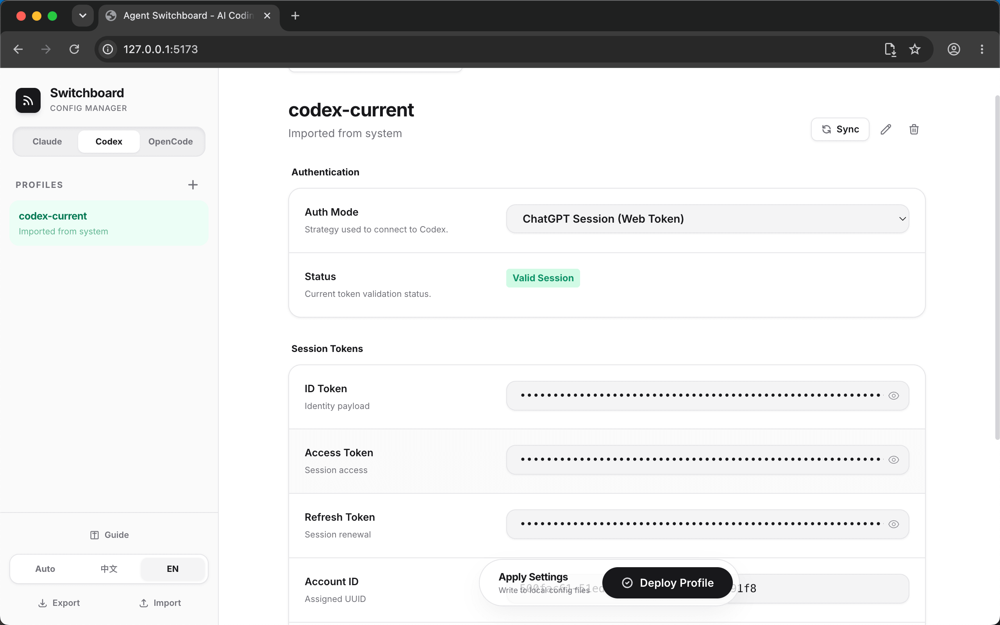

<div align="center">

# Agent Switchboard

**A local-only profile switcher for Claude Code, Codex CLI, OpenCode — with Python backend for full browser support.**

[中文](README.zh-CN.md) · [GitHub](https://github.com/xzulab/AgentSwitchboard) · [License](LICENSE)

</div>

```text
Open Source: https://github.com/xzulab/AgentSwitchboard
```

Agent Switchboard helps you manage local AI coding tool configurations as named profiles. Switch between models, API gateways, and authentication modes without manually editing config files.

## Preview

<p align="center">
  
</p>

## Highlights

- **Local first**: profiles stay in browser storage and authorized local files.
- **Multi-tool**: manage Claude Code, Codex CLI, and OpenCode separately.
- **Safe apply**: writes selected profiles back to disk with a snapshot before changes.
- **Codex ready**: supports `config.toml`, `auth_mode`, `auth.json`, API Key, and ChatGPT Session profiles.
- **Bilingual UI**: auto-detects Chinese or English, with manual switching in the sidebar.
- **Static deploy**: works on `localhost` or any HTTPS static host.
- **Python backend**: lightweight Flask server for Firefox / non-Chromium browsers.
- **Hidden files shown by default**: dotfiles (`.claude`, `.codex`, etc.) visible on Arch Linux and other distros.
- **Firefox support**: works in Firefox via server mode with file picker fallback.

## Friendly Links

- [linux.do](https://linux.do/)

## Screenshots

| Codex API Key | Codex ChatGPT Account |
| --- | --- |
|  |  |

## Supported Files

| Tool | File |
| --- | --- |
| Claude Code | `~/.claude/settings.json` |
| Codex CLI config | `~/.codex/config.toml` |
| Codex CLI auth | `~/.codex/auth.json` |
| OpenCode | `~/.config/opencode/opencode.json` |

## Quick Start

### Option A: Python Backend (recommended, all browsers)

```bash
python3 app.py
```

Open: http://localhost:5173/

### Option B: Static File Server (Chromium only)

```bash
python3 -m http.server 5173
```

Open: http://localhost:5173/

## Usage

1. Choose a tool: Claude Code, Codex CLI, or OpenCode.
2. Link the local configuration files required by that tool.
3. Import current settings or create a blank profile.
4. Edit model, endpoint, authentication mode, and related settings.
5. Apply the selected profile to write it back to local configuration files.

## Fixes (fork)

### Hidden Files on Arch Linux

The original app uses the File System Access API, which on Linux file pickers does not show dotfiles (`.claude`, `.codex`, etc.) by default. This fork:

1. **Default visible**: sets `FS.hiddenFiles = true` at startup.
2. **Toggle button**: adds a Hidden/Visible toggle in the sidebar header.
3. **Preference persisted**: saves the setting to `localStorage`.

### Firefox / Non-Chromium Support

The original app requires `showOpenFilePicker` (File System Access API), which is not available in Firefox. This fork:

1. **Detects browser capability**: checks for `showOpenFilePicker` in `window`.
2. **Server mode fallback**: when absent, uses `<input type="file">` + Python Flask backend.
3. **Flask backend** (`app.py`): lightweight server for file read/write via `/api/file/read` and `/api/file/write`.

## Security Boundary

- Agent Switchboard only accesses files you select or that are in trusted roots.
- Trusted roots default to `~/.claude`, `~/.codex`, `~/.config/opencode`.
- Profiles are stored in browser localStorage.
- Exported JSON may include API keys. Do not commit it to a public repository.

## Development

```bash
# Start Flask backend
python3 app.py --port 5173 --debug

# Or static server
python3 -m http.server 5173
```

## Project Structure

```text
.
├── app.py          # Python Flask backend (Firefox support)
├── start.sh        # Quick launcher script
├── run.sh          # Alternative launcher
├── docs/
│   ├── guide_zh.png
│   ├── guide_en.png
│   ├── codex_key_zh.png
│   ├── codex_key_en.png
│   ├── codex_account_zh.png
│   └── codex_account_en.png
├── index.html      # Single-file frontend (Chromium + Firefox)
├── LICENSE
├── README.md
├── README.zh-CN.md
├── vercel.json
└── wrangler.jsonc
```

## License

MIT
