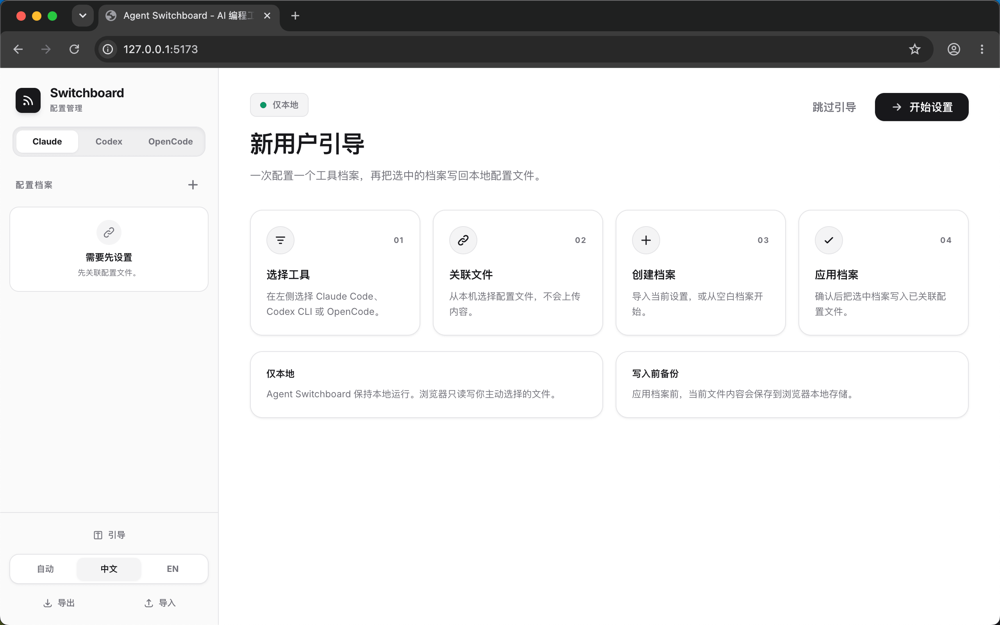
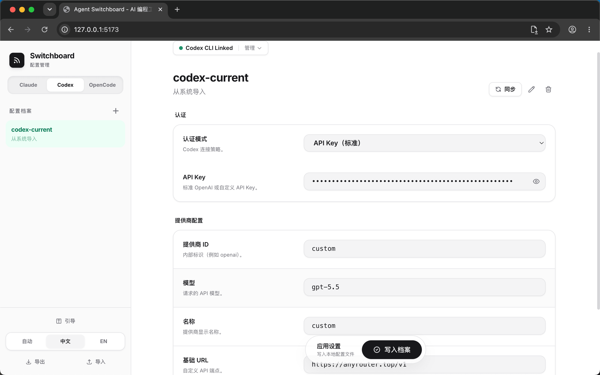
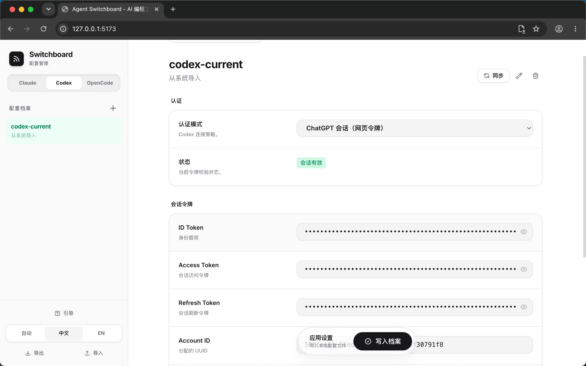

<div align="center">

# Agent Switchboard

**Claude Code、Codex CLI、OpenCode 的本地配置档案切换器。**

[English](README.md) · [GitHub](https://github.com/xzulab/AgentSwitchboard) · [License](LICENSE)

</div>

```text
Open Source: https://github.com/xzulab/AgentSwitchboard
```

Agent Switchboard 用一个静态网页管理 AI 编程工具的本地配置档案。你可以把不同模型、API 网关、认证方式保存成命名档案，再按需切换，不需要手动编辑配置文件。

它不需要后端服务，不需要数据库，也不会上传配置内容。浏览器只会读写你主动选择授权的本地文件。

## 界面预览

<p align="center">
  
</p>

## 核心亮点

- **本地优先**：档案保存在浏览器存储和你授权的本地文件中。
- **多工具管理**：分别管理 Claude Code、Codex CLI、OpenCode。
- **写入前快照**：应用档案前保存最近一次文件内容，便于回看。
- **Codex 友好**：支持 `config.toml`、`auth_mode`、`auth.json`、API Key 和 ChatGPT Session。
- **中英文界面**：根据浏览器语言自动切换，也可在侧栏手动选择。
- **静态部署**：支持 `localhost` 本地预览，也支持任意 HTTPS 静态托管。

## 友情链接

- [linux.do](https://linux.do/)

## 截图

| Codex API Key | Codex ChatGPT 账号 |
| --- | --- |
|  |  |

## 支持的配置文件

| 工具 | 文件 |
| --- | --- |
| Claude Code | `~/.claude/settings.json` |
| Codex CLI config | `~/.codex/config.toml` |
| Codex CLI auth | `~/.codex/auth.json` |
| OpenCode | `~/.config/opencode/opencode.json` |

## 快速开始

在仓库根目录启动静态文件服务：

```bash
python3 -m http.server 5173
```

打开：

```text
http://localhost:5173/
```

首次使用时，先绑定要管理工具的配置文件。macOS 文件选择器中可以按 `Command + Shift + .` 显示隐藏目录。

## 使用流程

1. 选择工具：Claude Code、Codex CLI 或 OpenCode。
2. 绑定该工具需要的本地配置文件。
3. 从当前配置导入档案，或新建空白档案。
4. 修改模型、网关、认证方式等配置。
5. 应用选中档案，写回本地配置文件。

## 安全边界

- Agent Switchboard 只访问你主动选择授权的文件。
- 文件句柄保存在浏览器 IndexedDB 中。
- 配置档案保存在浏览器 localStorage 中。
- 导出的 JSON 可能包含 API Key 或登录缓存，不要提交到公开仓库。
- 静态托管服务只负责托管页面，不会接收或保存你的本地配置文件内容。

## 部署

仓库已包含 `vercel.json`，Vercel 会把根路径 `/` 重写到 `index.html`。

```bash
vercel
vercel deploy --prod
```

如果使用 Vercel 控制台部署，导入仓库后选择 `Other` 或 `No Framework`，Build Command 留空，Output Directory 使用默认根目录。

## 项目结构

```text
.
├── docs/
│   ├── guide_zh.png
│   ├── guide_en.png
│   ├── codex_key_zh.png
│   ├── codex_key_en.png
│   ├── codex_account_zh.png
│   └── codex_account_en.png
├── LICENSE
├── README.md
├── README.zh-CN.md
├── index.html
└── vercel.json
```

## 开发说明

当前项目保持为单文件实现，便于直接托管和审计。后续如果引入构建链，需要确保 File System Access API、权限提示、配置写回逻辑仍然可以在 HTTPS 或 `localhost` 环境下正常工作。

## 贡献

欢迎提交 Issue 或 Pull Request。比较适合的改进方向包括：

- 新增更多 AI 编程工具的配置适配
- 增加配置差异预览
- 增加备份恢复界面
- 改进移动端和窄屏布局

## License

MIT
